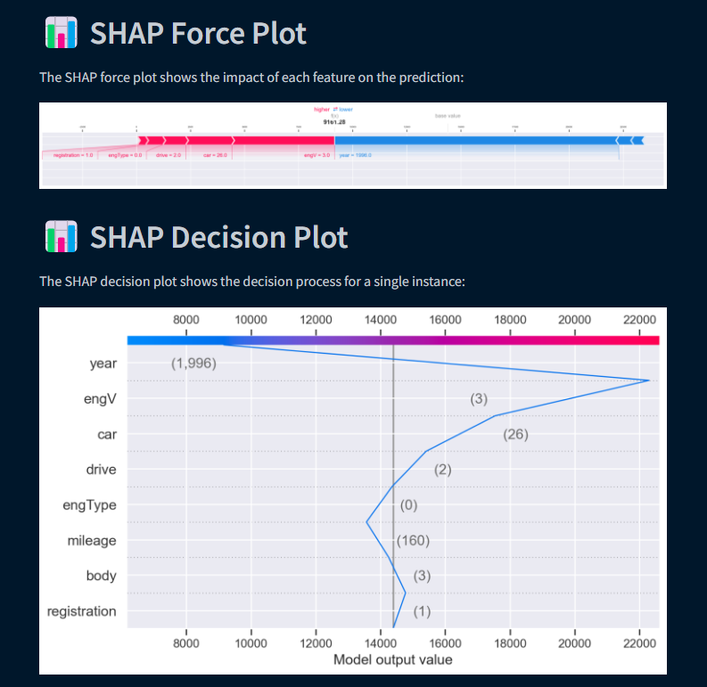

# Car-Price-Prediction-Web-App-with-XAI
This project creates a Streamlit app for predicting used car prices. It analyzes historical car data and builds a machine learning model to estimate a car’s value. The app incorporates Explainable AI (XAI) to explain key price-influencing factors, providing users with clear insights into the predicted prices.


Run the web app by navigating to the streamlit directory and executing the following command:

```
streamlit run Welcome.py
```

Some of the most relevant features from the WebAPP are:

## Exploratory Data Analysis 


## Car Price Predictor


## Explainable AI


